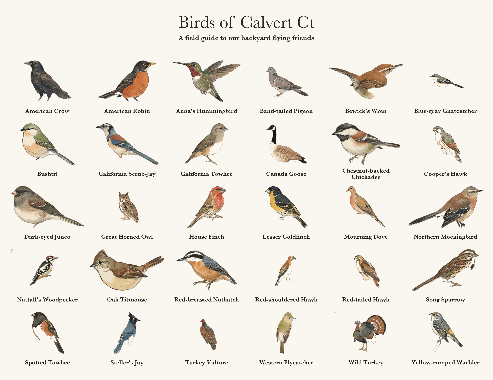

# Birds of Calvert Ct

A labeled field-guide collage of the birds we've seen around Calvert Ct, built
from illustrated plates with ImageMagick.



## Adding a bird you just saw

1. Find its filename stem (the scientific name) in the lookup table:
   ```bash
   grep -i "scrub-jay" library-index.csv
   ```
2. Add a line to `birds.txt`:
   ```
   California Scrub-Jay | aphelocoma-californica
   ```
3. Rebuild:
   ```bash
   python3 build_collage.py
   ```
4. Commit the updated `birds.txt` and `birds-of-calvert-ct.png`.

If you're working with Claude, you can just say *"I saw a Bullock's Oriole, add
it"* — the full procedure (including how to handle vague names like "an oriole")
is in [AGENTS.md](AGENTS.md).

## How it works

`build_collage.py` reads the observed list in `birds.txt`, pulls each species'
illustration from `illustrations/`, and composites a 6-wide grid with a title and
labels. Two details make it look like a real field-guide plate rather than a
naive contact sheet:

- **Birds are normalized by content area**, so a wide perched bird and a tall
  upright bird carry the same visual weight.
- **Long names wrap to two lines**, so every label is set at the same large size.

## Layout

| Path | What it is |
|------|-----------|
| `birds.txt` | Observed birds, in display order — edit this to change the collage |
| `library-index.csv` | Common name ↔ scientific stem ↔ family ↔ California status for all 249 available species |
| `illustrations/` | The full source art library (450 PNGs); the collage only uses what's listed in `birds.txt` |
| `build_collage.py` | The builder |
| `birds-of-calvert-ct.png` | The generated collage |

## Requirements

- ImageMagick 7 (`magick`)
- Python 3
- Baskerville font (ships with macOS)

## Credits

Bird illustrations from the AvianVisitors illustration set.
